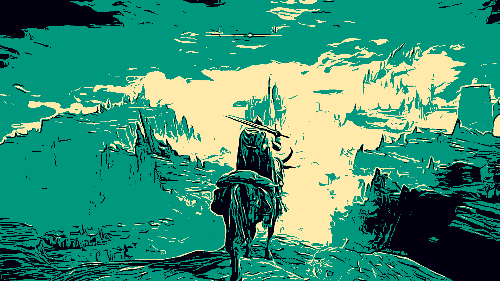
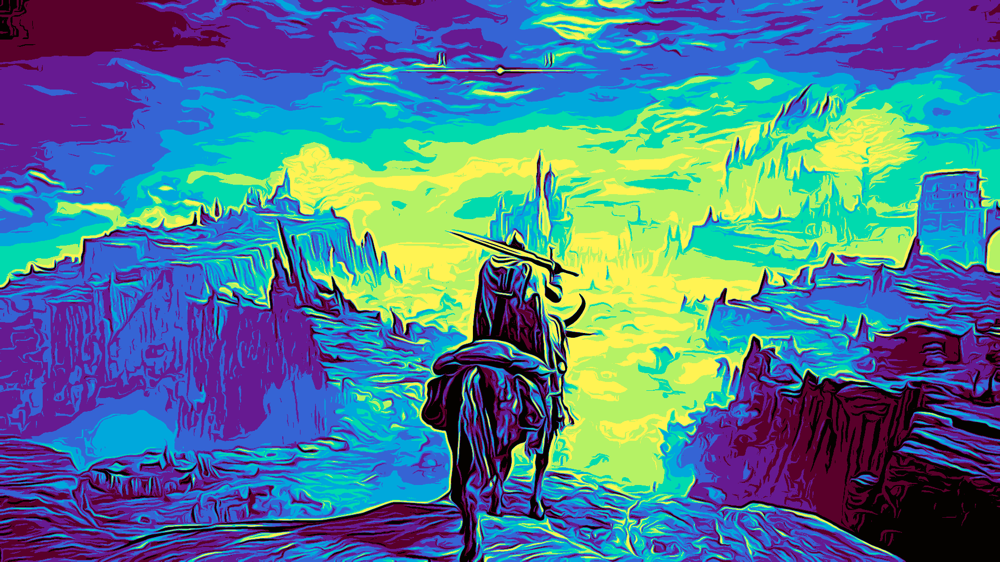
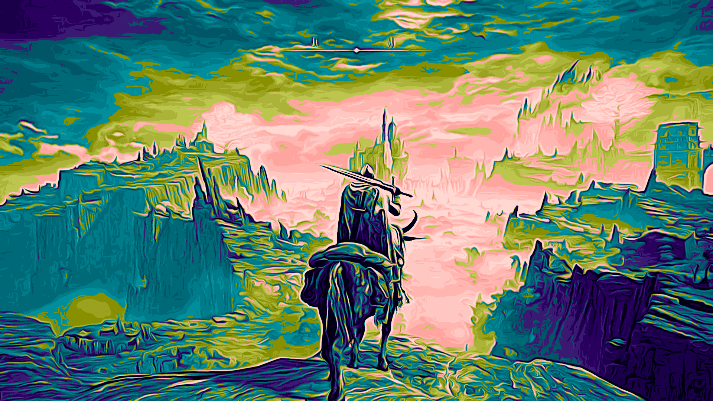
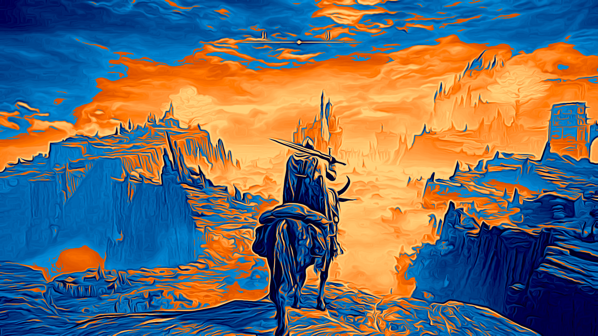

# Color Palette

A Java Maven application (NetBeans/Swing) for quantizing images and interactively editing their color palettes using perceptually uniform **OKLab/OKLCh** color spaces.

  
  

  
  

## **Features**

- **Image Quantization**  
  - Grayscale or full-color quantization via my own [dithering-java](https://github.com/PedroFellipeAntunes/dithering-java) code   
  - Adjustable number of levels and optional channel-range mode  
- **Palette Generation & Editing**  
  - Random gradient (“modes”) generation with clockwise/CCW hue segments  
  - Single-color or full palette randomization  
  - Hue inversion (±180°), reset single/all colors  
- **OKLab/OKLCh Conversions**  
  - sRGB ↔ OKLab ↔ OKLCh transforms for perceptual correctness  
  - Internally works in OKLab/Ch for interpolation, outputs back to sRGB  
- **Interactive GUI**  
  - Grid of color swatches plus L, C, H sliders  
  - Live preview of result applied to image  
  - Keyboard shortcuts: ←→↑↓ navigation, Ctrl+R, Ctrl+C/V, Delete  
- **File I/O**  
  - Saved output named `palette[color_quantity].png` in source folder  

---

## **TODO**
Add text area with the HEX code of the current selected color  
